<h3><code>rezya@github ~ $ whoami</code></h3>

<table width="100%" style="border-collapse: collapse; border: none;">
  <tr>
    <td width="42%" valign="top" style="border: none;">
      
    </td>
    <td width="58%" valign="top" style="border: none;">
      
    </td>
  </tr>
</table>

---

<table width="100%" style="border-collapse: collapse; border: none;">
  <tr>
    <td width="60%" valign="top" style="border: none;">
      <h3>👾 About Me</h3>
      
Hey, I'm <b>Rezya</b>! Currently surviving college life at Binus University (Class of 2029). Day-to-day, you'll find me exploring Full-Stack development, diving into cybersecurity, or grinding ranks in Valorant and Roblox. Even though I play on PC, I'm a hardcore mobile gaming fan at heart 📱.

      
Whenever my brain fries from debugging code, my escape is usually UI designing, photo editing, or dabbling in video creation for fun 🎨🎬. I'm an ambivert—super easygoing and down for networking or hanging out, but I definitely need my solo recharge time too.

    </td>
    <td width="40%" valign="top" align="center" style="border: none;">
      <h3>🎯 Connect & Ping Me</h3>
        
        
        
      
    </td>
  </tr>
</table>

---

<table width="100%" style="border-collapse: collapse; border: none;">
  <tr>
    <td width="50%" align="center" valign="top" style="border: none;">
      <h3>🎮 Live Status</h3>
      <i>(Real-time from Discord)</i>  
      
    </td>
    <td width="50%" align="center" valign="top" style="border: none;">
      <h3>🎧 Vibe Check</h3>
      <i>(Current Anthem)</i>  
        
      
    </td>
  </tr>
</table>

---

### 🛠️ Tech Stack & Arsenal

  

---

### 📊 Terminal Stats & Contributions

  <h3><code>rezya@github ~ $ ./contributions.sh</code></h3>
  <picture>
    <source media="(prefers-color-scheme: dark)" srcset="https://raw.githubusercontent.com/Blank-MC/Blank-MC/output/pacman-dark.svg">
    <source media="(prefers-color-scheme: light)" srcset="https://raw.githubusercontent.com/Blank-MC/Blank-MC/output/pacman-light.svg">
    
  </picture>

 

  
  

 

  

---

<table width="100%" border="0" cellpadding="0" cellspacing="0" style="border-collapse: collapse; border: none;">
  <tr>
    <td width="50%" align="center" style="border: none; padding-bottom: 5px;">
      <h3><code>> ./joke.sh</code></h3>
    </td>
    <td width="50%" align="center" style="border: none; padding-bottom: 5px;">
      <h3><code>> ./grind-streak.sh</code></h3>
    </td>
  </tr>
  <tr>
    <td width="50%" align="center" valign="top" style="border: none;">
      

        
      

    </td>
    <td width="50%" align="center" valign="top" style="border: none;">
      

        
      

    </td>
  </tr>
</table>

